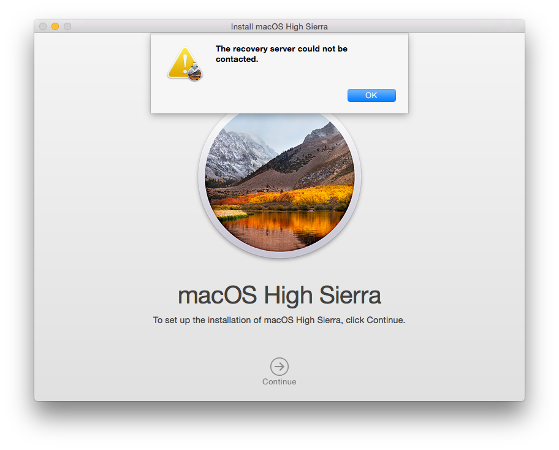

(based on dubsteptwo's EFI)

## Note
This EFI is based for macOS 10.13

## Prerequisites
- The same exact laptop
- 2 GB+ flash drive (fast one is recommended)
- Windows 10 and up (maybe Windows 8 / 8.1 will work with Python 3, idk)
- Python 3 (>=3.9)
- Some knowlege of what you're doing

## What changed
- Model (from MacBookAir6,1 "Haswell" to 'MacBookPro8,1 "Sandy Bridge") - fixes graphics after 10.13
- USB 2 & 3 support
- Added NullCPUPowerManagement.kext, won't boot without it

## What doesn't work (still)
- Webcam 

## Download
[Latest (v1.0.7)](https://github.com/MIAMIcooler/Asus-K53SC-OpenCore/releases/download/c/a.zip) | [v1.0.6](https://github.com/MIAMIcooler/Asus-K53SC-OpenCore/releases/download/b/a.zip) | [v1.0.3 (debug)](https://github.com/MIAMIcooler/Asus-K53SC-OpenCore/releases/download/a/a.zip)

## How to make it work
Download macOS 10.13 with macrecovery using either: 
```
py macrecovery.py -b Mac-7BA5B2D9E42DDD94 -m 00000000000J80300 download
```
```
py macrecovery.py -b Mac-BE088AF8C5EB4FA2 -m 00000000000J80300 download
```
You need to:
- Format the flash drive (2GB in FAT32 - works the best)
- Put the files in there (EFI and com.apple.recovery.boot on the root of the drive)
- Set up SMBIOS (just for it to be different)

Or follow the guide: [https://dortania.github.io/OpenCore-Install-Guide](https://dortania.github.io/OpenCore-Install-Guide)

#### Recommended to remap USB via USBToolBox:
1. Go to "C. Change Settings" -> enable both Native Classes and Legacy Native Classes (N and L), then B to get back
2. Go to "D. Discovr Ports" -> connect any USB device to every USB port, then B to get back
3. Go to "S. Select Ports And Build Kext" -> K. Build Kext -> enter "MacBookPro8,1"
4. Copy the USBMapLegacy.kext folder to "Kexts" foldr in OC

#### Recommended to regenerate SMBIOS info:
1. Open GenSMBIOS, then "2. Select config.plist"
2. Drag and drop config.plist, then Enter
3. "3. Generate SMBIOS" -> input "MacBookPro8,1", tthen Enter. It'll automatically put the info in config.plist

#### Make sure you have enabled UEFI Boot in the BIOS

## The Recovery Server Could Not Be Contacted


For this, go to Utilities -> Terminal, and type / paste this:
```
nvram IASUCatalogURL="http://swscan.apple.com/content/catalogs/others/index-10.13-10.12-10.11-10.10-10.9-mountainlion-lion-snowleopard-leopard.merged-1.sucatalog"
```

## How to make it boot from the hard drive

1. Install a linux distro of your choice (in this ex. Ubuntu) in UEFI mode, so it creates an NVRAM entry
2. Navigate to the EFI partition, then EFI/BOOT, and change BOOTx64.efi to the one in the OpenCore EFI folder
3. Go to EFI/ubuntu, and delete 'grubx64.efi', copy the BOOTx64.efi, and rename it to 'grubx64.efi'

If it doesn't use GRUB as a bootloader, change all .efi files in BOOT and the 2nd folder (if present) to the **exact names** in the folder
